\begin{titlepage}
\centering
\vspace*{1.6cm}

{\Huge\bfseries DSM050 Data Visualisation\par}
\vspace{0.55cm}
{\Large Hadar Sharon\par}
\vspace{0.2cm}
{\large 2026-09-14\par}

\vspace{1.3cm}
{\LARGE\bfseries Final coursework assignment\par}
\vspace{0.45cm}
{\Large University of London\par}
\vspace{0.25cm}
{\large April 2026 session, MSc Data Science programme\par}

\vfill

{\small
\textbf{Project repository:}
\url{https://github.com/hadarsharon/DSM050_Final_CW}
\par}

\vspace{1.0cm}
\end{titlepage}

# Introduction

## ___Camels in Transition___

### _Mapping the changing scale, geography, and production intensity of global camel husbandry, 1961-2024_

Throughout history, camels have been important livestock in environments where water is scarce, heat is intense and foraging is challenging for most domestic species. Camels occupy a distinctive role in arid and semi-arid livestock systems - the Food and Agriculture Organization of the United Nations (FAO) describes them as multipurpose animals used for milk, meat, fibre, transport, and work. Their physiological tolerance of heat and water scarcity makes them especially important in dryland pastoral economies.

This project investigates how global camel husbandry has changed over more than six decades, using data from the __FAOSTAT Crops and Livestock Products (QCL)__ dataset.

One of the main issues encountered in this project is that global camel statistics are not all based on evidence of the same type or quality. National censuses, official submissions, FAO estimates and changes in political reporting entities can create apparent discontinuities that should not be interpreted naively (Faye, 2020). Data quality is therefore examined alongside the reported trends throughout the project.

# Research topic

__How have the scale, geography and productive role of global camel husbandry changed since 1961, and how does data provenance affect the confidence we can place in that picture?__

## Research questions

* __RQ1:__ How has reported global camel stock changed between 1961 and 2024, and when did growth accelerate or slow?
* __RQ2:__ How has the regional distribution of camel stock changed, and which countries dominate the contemporary herd?
* __RQ3:__ How strongly is national camel herd size associated with recorded milk and meat production in 2024, and which countries deviate most from the broad relationship?
* __RQ4:__ How do leading camel-producing countries achieve milk and meat output through combinations of production scale (animals milked/slaughtered) and productivity (milk yield/carcass weight)?
* __RQ5:__ How much of reported camel stock is official versus estimated or imputed, and how should this qualify interpretation of recent country-level patterns?

# Data collection / Survey design

The data were downloaded directly from the __Food and Agriculture Organization of the United Nations (FAO), FAOSTAT Crops and Livestock Products domain (QCL)__. The analysis uses the raw, non-normalised FAOSTAT export rather than the available pre-normalised version so that the transformation from its wide annual structure into a tidy analytical dataset is explicit and reproducible. The complete computational workflow is provided separately in the accompanying Jupyter Notebook.

FAOSTAT describes the main sources as official statistics supplied by member countries, originating from surveys, administrative data and expert estimates. Where official data are unavailable, unofficial sources, estimates or imputations may be used and are flagged accordingly.

FAOSTAT is particularly suitable for this analysis because it provides stock, milk and meat measures within the same statistical system, covering more than six decades and several geographic levels. This supports comparisons from World and continental aggregates down to contemporary countries without combining unrelated data sources. Its provenance flags are also analytically useful because they make it possible to investigate not only the reported values themselves but how those values were produced. 
However, using a common international dataset does not mean that measurement quality is consistent across countries or years.

From an __ethical and legal perspective__, the dataset contains aggregate agricultural statistics rather than personal or individual-level records, so privacy risk is minimal. FAOSTAT is released under CC BY 4.0. 
The main ethical concern is how the data are represented. Estimated livestock figures can appear more precise in a visualisation than the underlying evidence justifies.

# Data overview and pre-processing

## Inspecting the non-normalised source (raw data)

The analysis uses three exact FAOSTAT items:

- `Camels` - live animal stocks (`An`, animals)
- `Raw milk of camel` - milk animals, production (`t`) and yield (`kg/An`)
- `Meat of camels, fresh or chilled` - animals slaughtered, production (`t`) and yield/carcass weight (`kg/An`)

The bulk data file also includes global, regional and special aggregates, as well as historical political entities. Global and regional results therefore use FAOSTAT's own aggregate rows. Contemporary country comparisons retain only M49 identifiers that map to present-day ISO-3166 entities, while historical reporting entities are handled explicitly only where needed for long-run provenance checks.

The raw QCL production table and its supporting area, item and flag lookup tables were inspected before filtering and reshaping. The production file contained 78,974 rows and 201 columns, reflecting its wide annual structure.

The source table is intentionally wide. Each logical series (country|item|element|unit) occupies one row, while each year is represented by three columns: a value (`Y1961`), a flag (`Y1961F`) and an optional note (`Y1961N`). This structure is convenient for distribution but not for analysis, so the central transformation is a wide-to-long reshape that keeps values, flags and notes aligned.

## Narrowing the analytical scope

Only items required by the research questions are retained. Although offal, fat and "other camelids" appear in the camel-related search results, they are excluded because they would broaden the analysis beyond the central stock/milk/meat narrative. "Other camelids" data would additionally introduce non-camel species, such as llamas and alpacas.

## Reshaping the value/flag/note triplets to tidy long form

This transformation is explicit rather than relying on the normalised data export available from FAOSTAT. A row in the resulting table represents a single `Area|Item|Element|Year` observation. Missing numeric values are intentionally not converted to zero: absence of a recorded figure is analytically different from a measured zero. `M` flags are retained because they communicate structural missingness. The reshape retained 21,538 observations containing either a numeric value or an explicit provenance flag.

## Separating aggregates and validating key units

`World`, continents and FAO development groupings do not map to ordinary ISO country codes and are kept separately. This avoids the common error of summing national observations together with regional/world aggregates.

A second issue is __political continuity__. FAOSTAT contains historical reporting entities such as `USSR`, `Ethiopia PDR` and `Sudan (former)`. Excluding them is appropriate for contemporary country comparisons but would make early national totals incomplete. For long-run provenance calculations these three entities are therefore retained alongside present-day ISO-mappable countries. Their series end when their successor reporting entities begin, so the combined reporting entity series reconciles to the FAOSTAT World aggregate without double counting. 
It also prevents historical and present-day political entities from being treated as directly continuous in country rankings. (Faye, 2020).

FAOSTAT uses `An` for animal counts, `t` for tonnes, and `kg/An` for yield/carcass weight. No cross-unit aggregation is performed.

## Handling missingness and interpreting dataset flags

The FAOSTAT flags are analytically meaningful:

- __A__ - official figure
- __E__ - estimated value
- __I__ - value imputed by a receiving agency
- __X__ - figure from an external organisation
- __M__ - missing value, data cannot exist

A flag is not a standard error or confidence interval. The flags are used to group and contextualise observations, not as measures of statistical uncertainty. 

# Analysis and results

The analysis is designed as a continuous visual narrative rather than as five independent answers to the research questions. It progresses from global scale to geographic redistribution, national trajectories, stock–output relationships, production mechanisms and finally, data provenance. Position and length are preferred where precise quantitative comparison matters, while colour, area and geographic position are used to reveal broader patterns, groupings, or spatial structure. 
Logarithmic scales are used only for variables spanning several orders of magnitude.

## RQ1 - How has the global camel population changed?

The World aggregate is used directly rather than recreated from country rows. This avoids distortions caused by changes in country coverage and political geography.

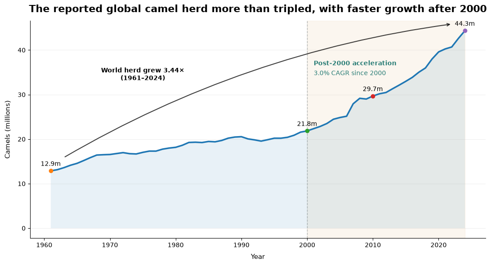{width=100%}
This figure shows that the reported world herd rises from about __12.9 million__ animals in 1961 to __44.3 million__ in 2024. Across the full 63-year period this corresponds to an annualised growth rate of approximately 2.0%, but the period averages conceal a pronounced change in pace - __the growth is not uniform__. The 1980-2000 period is comparatively slow, whereas the 2000s and 2010s each show annualised growth around 3%. 
The figure points to faster growth after 2000, although the world series remains a reported aggregate rather than a complete census of observed animals. (RQ5 will later determine whether recent totals depend heavily on imputation).

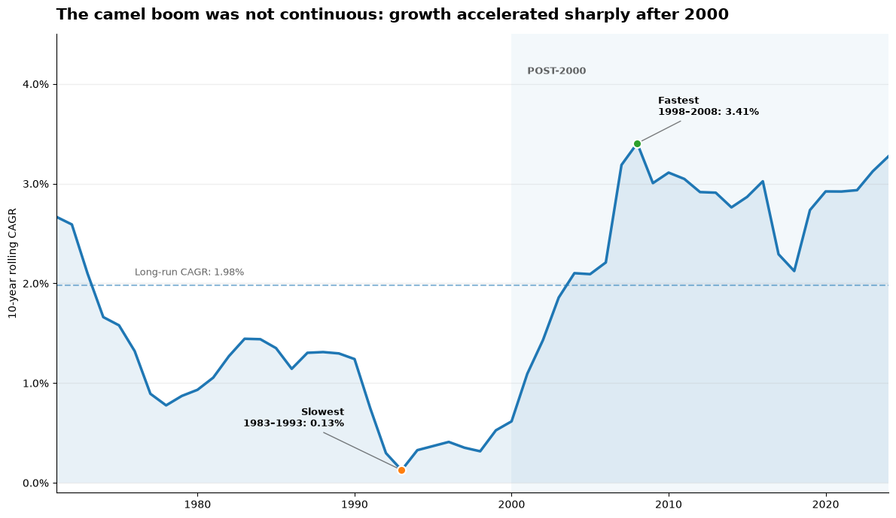{width=100%}
Here we can see that the long-run increase was not a steady process. The ten-year annualised growth rate __fell to almost to zero around the early 1990s__ before accelerating rapidly after 2000. The strongest rolling decade ended in 2008, recording approximately 3.4% growth per year. 
Rolling growth remains relatively high for several subsequent years, so the post-2000 rise cannot be attributed to a single anomalous year.

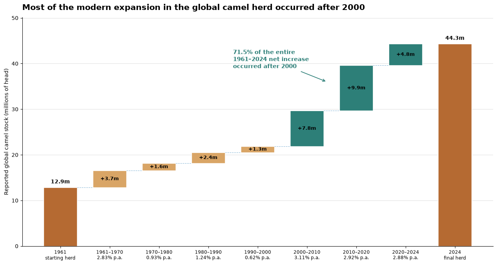{width=100%}
This figure decomposes the change in absolute numbers and makes the temporal shift especially clear. Only around 1.3 million additional camels were recorded between 1990 and 2000. By contrast, the reported herd increased by approximately 7.8 million during 2000–2010 and a further 9.9 million during 2010–2020. In total, roughly 71.5% of the entire net increase observed between 1961 and 2024 occurred after 2000. 
Most of the net increase in reported camel numbers has occurred during the 21st century.

## RQ2 - How has camel geography and concentration changed?

To distinguish absolute global growth from geographic redistribution, continental stocks are expressed as shares of FAOSTAT's reported World total.

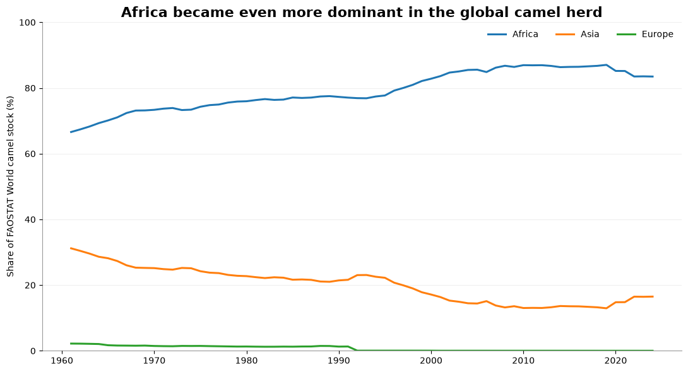{width=100%}
Africa's share increases from roughly __66.6% in 1961__ to __83.5% in 2024__. Africa's growing dominance notwithstanding, it was __not completely monotonic__. Its share reached approximately 86.9% in 2010 before easing to 83.5% in 2024 as Asia regained a small proportion of the global total.

Contemporary concentration is assessed by ranking present-day countries by reported 2024 stock and expressing each national herd as a share of the FAOSTAT World aggregate.

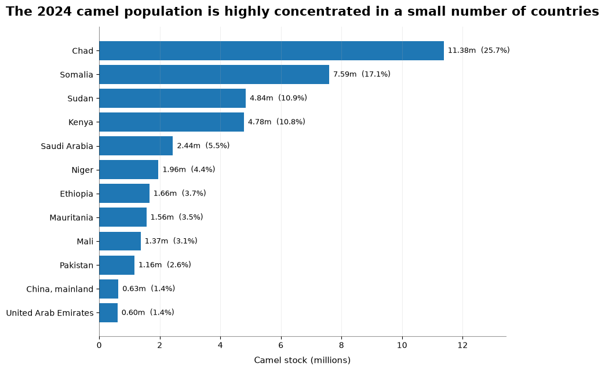{width=100%}
Chad alone represents approximately 25.7% of reported World stock and Somalia a further 17.1%, meaning that __these two countries alone account for more than two-fifths of the global total__. The five largest national herds together account for 70.0%, rising to 87.4% for the top ten. The contemporary geography of camel husbandry is therefore not simply Africa-dominated, but concentrated within a relatively small number of national populations.

The location of the recent expansion is examined by comparing country-level stocks in 2000 and 2024 for present-day countries with observations at both endpoints.

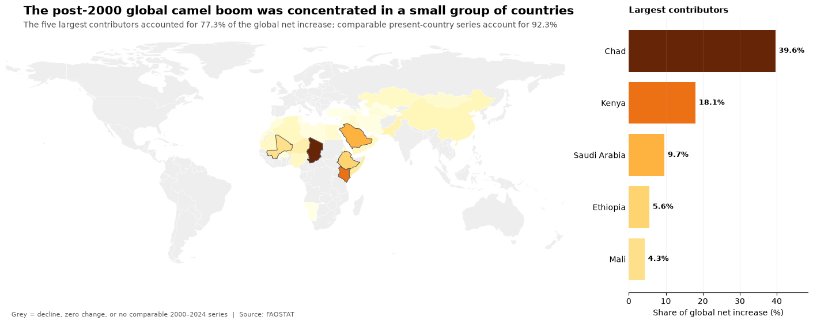{width=100%}
The 2000–2024 map locates most of the net increase in the Sahel, Horn of Africa and East Africa. Chad is the single largest contributor to post-2000 growth, with Kenya, Saudi Arabia, Ethiopia and Mali also prominent. 
Most of the increase is concentrated in the Sahel, Horn of Africa and East Africa, rather than being spread evenly across camel-keeping regions.

A single national ranking covering 1961–2024 is not used because FAOSTAT's reporting geography changes over time (`USSR`, `Ethiopia PDR` and `Sudan (former)` as examples) - a long-run ranking would either exclude historically important reporting entities or compare changing states as if they were continuous. Long-run geographic change is instead shown using FAOSTAT's stable world/continental aggregates, while country trajectories are restricted to present-day countries with observations at both endpoints (Faye, 2020).

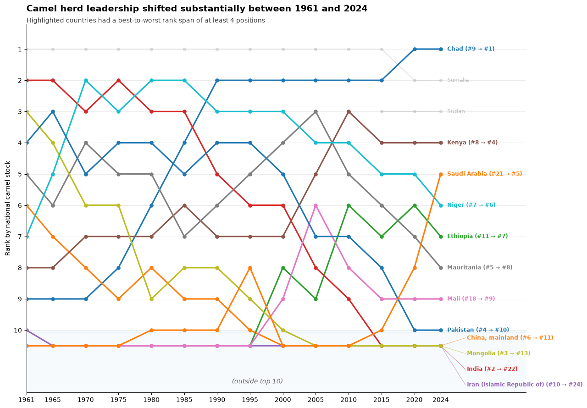{width=100%}
The ranking view highlights substantial turnover in national herd leadership, while the indexed trajectories reveal differences in both the magnitude and timing of long-run change.

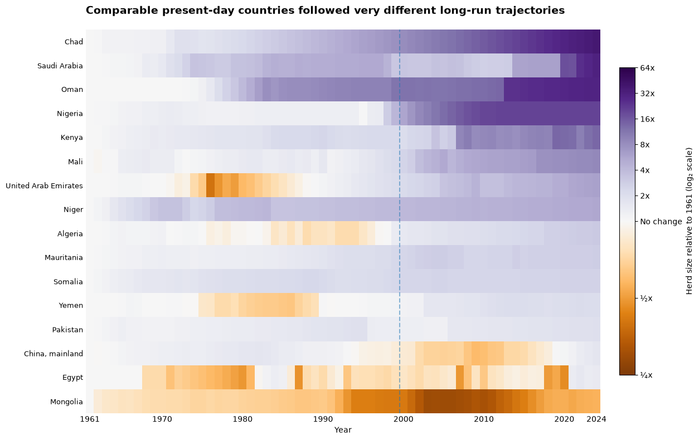{width=100%}
Among present-day countries with observations at both endpoints, the indexed heatmap shows that the camel boom was far from uniform. Chad, Saudi Arabia, Oman and Nigeria recorded very strong long-run expansion, but the timing differed substantially. Nigeria and Kenya, for example, accelerated mainly after 2000, whereas Saudi Arabia and Oman experienced substantial earlier growth. At the opposite extreme, Mongolia's 2024 herd remained below its 1961 level. These trajectories complement the aggregate regional story without treating historical political entities as if national boundaries had remained fixed since 1961.

## RQ3 - How strongly is herd size associated with recorded milk and meat output?

A country with more camels has a larger potential production base, but total herd size is not in itself a production measure. Milk depends on how many animals are actually milked and their yield, likewise meat depends on slaughter numbers and carcass weight. 

RQ3 therefore asks how strongly __total national camel stock__ is associated with recorded annual output, and which countries depart most from that broad relationship. FAOSTAT's reference periods are not perfectly aligned: livestock numbers are grouped into 12-month periods ending 30 September, while milk and meat generally refer to calendar years. 
The 2024 data provides an approximate cross-section, since stock and production measures do not use exactly the same reference periods. Meat data also refer to animals slaughtered within national boundaries irrespective of origin, which can further weaken a simple herd-to-output relationship.

After matching 2024 stock observations to recorded production data, the cross-sectional comparison contains 29 countries for milk and 37 for meat.

Because herd sizes and production quantities span several orders of magnitude, both are plotted on logarithmic scales. 
The fitted line is descriptive and is not intended as a causal production model. Countries are compared with the output fitted from herd size alone; $R^2$ is reported on the log-transformed scale.

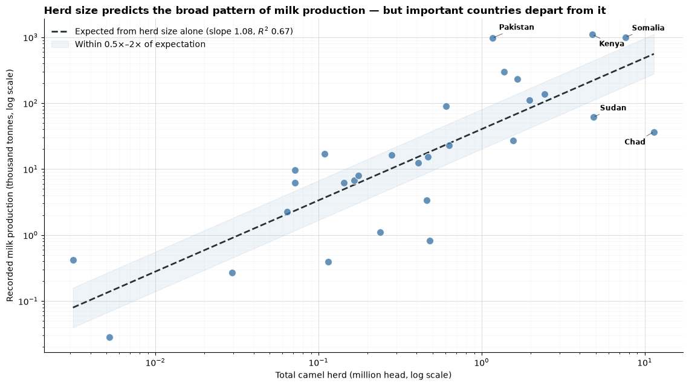{width=100%}
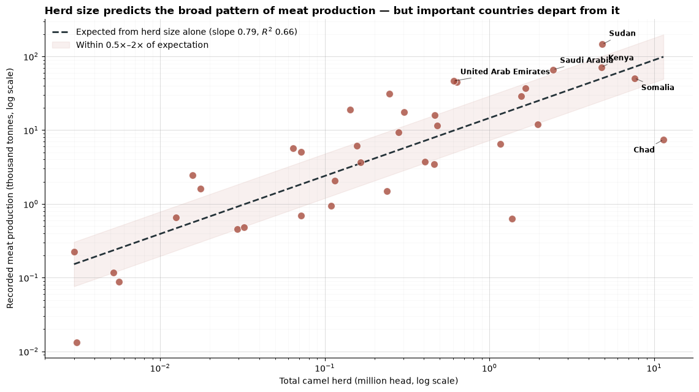{width=100%}
On the log-transformed scale, the bivariate herd-size model accounts for approximately 67% of the variation in log recorded milk output ($R^2 \approx 0.67$) and 66% for meat ($R^2 \approx 0.66$). 
Herd size is clearly related to production, but it leaves roughly one-third of the variation unexplained. The remaining variation may reflect production intensity, herd utilisation or reporting differences, although the model cannot separate these effects.

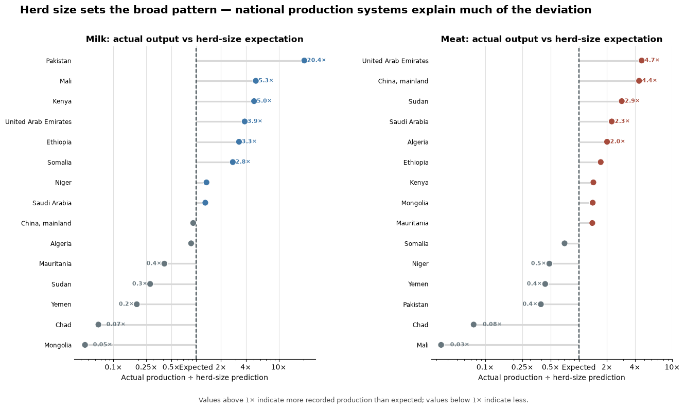{width=100%}
Pakistan is the clearest milk-side deviation, while several large-herd countries record considerably less output than the herd-only fit would suggest. 
RQ4 examines whether these differences come from the number of animals used for production, recorded productivity, or both.

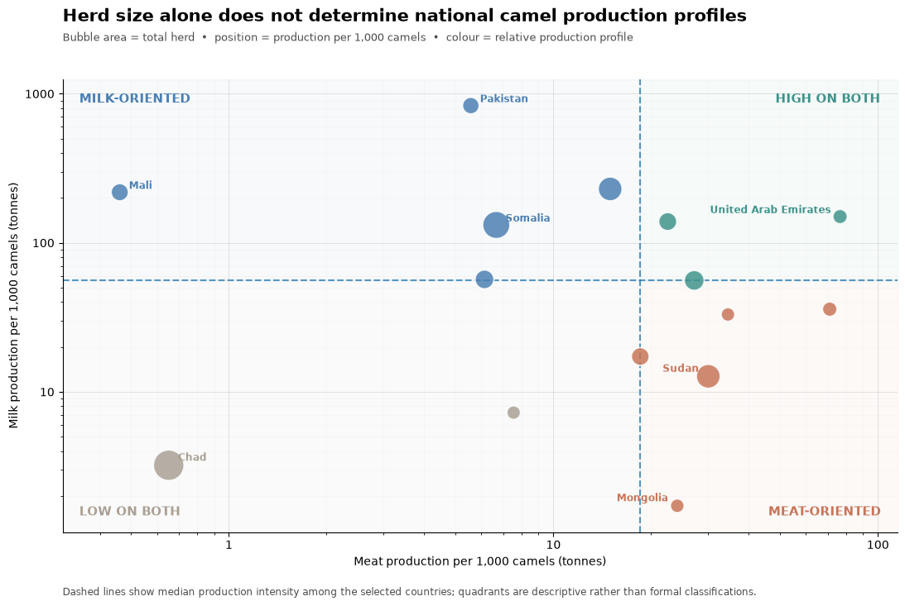{width=100%}
This comparison shows that national camel herds are not associated with uniform recorded production intensity. In other words - recorded production intensity differs substantially between countries: Pakistan, Mali and Somalia sit in the chart's milk-oriented quadrant, while Sudan and Mongolia show much stronger meat intensity relative to milk. Chad, despite having the largest herd in the plot, lies near the low end of both measures, whereas the United Arab Emirates combines a comparatively modest herd with high recorded intensity for both products.
The quadrants are descriptive only and are not intended as formal classifications of national production systems.

## RQ4 - How is output produced through scale and productivity?

FAOSTAT's production elements allow a useful decomposition of recorded output:

- __Milk production__ reflects the number of milk animals together with recorded milk yield.
- __Meat production__ reflects the number of animals slaughtered together with recorded carcass weight.

Separating the components makes it possible to distinguish output driven mainly by the number of animals from output associated with higher recorded yield or carcass weight.

Pakistan illustrates the distinction particularly clearly. It records approximately 968,000 tonnes of camel milk from about 431,000 milk animals, almost matching Somalia's 1.00 million tonnes despite Somalia reporting approximately 2.51 million milk animals. The difference corresponds to a recorded yield of about 2,246 kg per milk animal in Pakistan, compared with 399 kg in Somalia and 654 kg in Kenya.

These differences cannot be attributed to biological productivity alone. Production systems, statistical definitions and estimation practices may also contribute to the contrast.

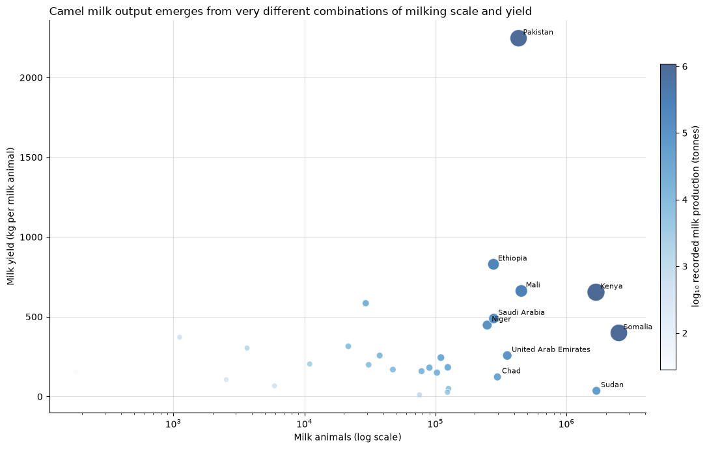{width=100%}
The meat decomposition shows a parallel example. Sudan and Saudi Arabia report broadly similar slaughter numbers - approximately 540,000 and 501,000 animals respectively - but Sudan records more than twice the meat tonnage. Their reported carcass weights, approximately 269 kg and 132 kg per animal respectively, account arithmetically for much of this difference.

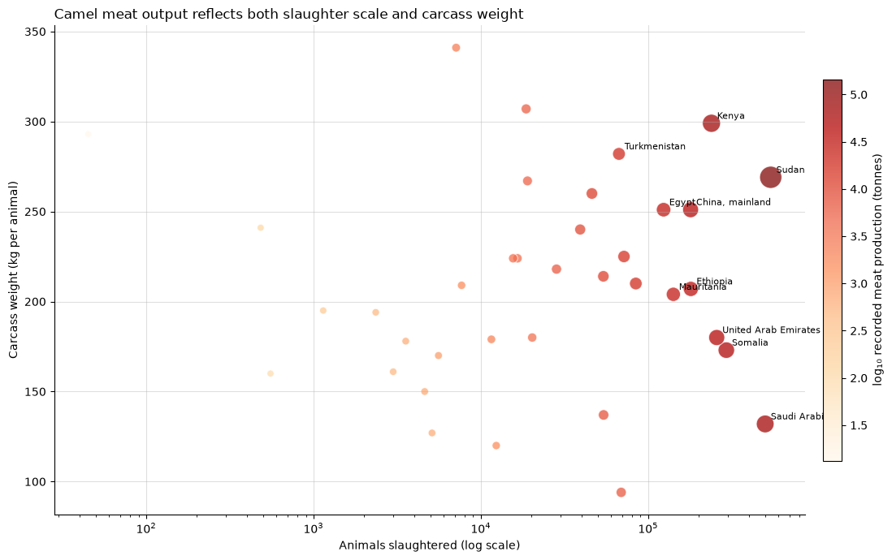{width=100%}
At World level, recorded camel milk output rises about __6.7x__ between 1961 and 2024 and camel meat about __5.4x__, both faster than the approximately __3.4x__ increase in stocks. Higher utilisation or productivity may have contributed to this increase, but changes in reporting and imputation also prevent a causal interpretation.

## RQ5 - How does data provenance qualify the apparent picture?

Data provenance is assessed by calculating the share of represented camel stock associated with each FAOSTAT flag. These percentages are stock-weighted: they represent the proportion of reported camel numbers associated with each provenance category rather than the proportion of reporting countries.

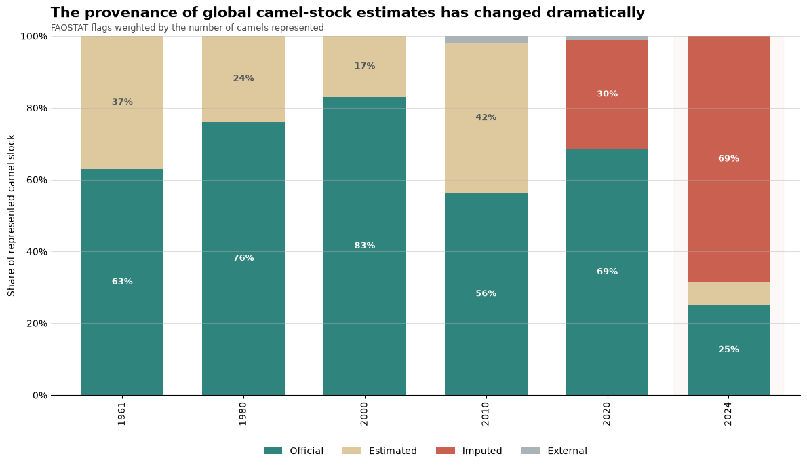{width=100%}
The historical composition changes sharply. Official figures represented approximately 83.0% of the stock-weighted total in 2000, compared with only 25.2% in 2024, while the imputed share rises from effectively zero in earlier benchmark years to 30.3% in 2020 and 68.6% in 2024.

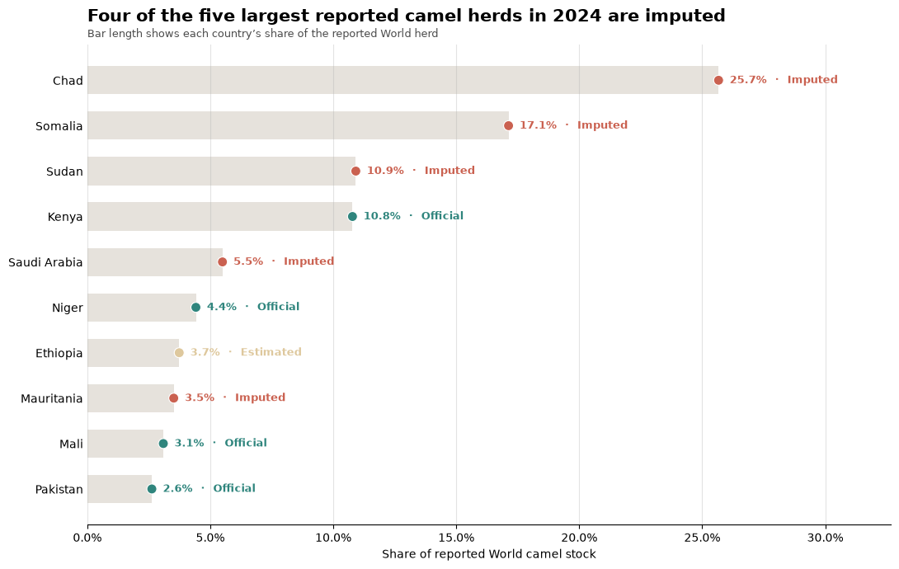{width=100%}
This figure shows that the recent reliance on imputation is concentrated among consequential national series: four of the five largest reported camel herds in 2024 carry an imputed flag. An imputed value is not necessarily incorrect - where official reporting is unavailable, imputation may be the best available estimate. The flag affects how confidently the value should be interpreted - it does not make the value unusable.

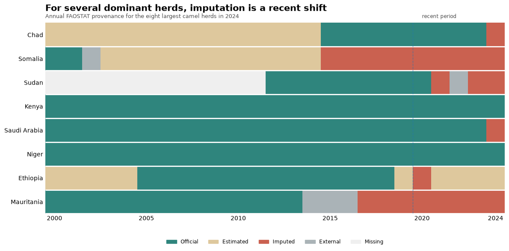{width=100%}
The annual provenance fingerprint shows that, for several dominant herds, imputation is a relatively recent shift rather than a characteristic of the entire historical series. 
Without this context, precise-looking country rankings can overstate the certainty of the underlying data.

This does not make FAOSTAT unusable; on the contrary, the flags add analytical value by allowing provenance to be communicated rather than hidden. 
The broad patterns of global growth and concentration remain clear, but recent country estimates should not all be treated as equally certain.

# Conclusions

The visual investigation reveals a clear long-run expansion and geographical concentration of reported camel husbandry. FAOSTAT's World stock increases from approximately __12.9 million animals in 1961 to 44.3 million in 2024__, with about __71.5% of the net increase occurring after 2000__. At the same time, Africa's share rises from roughly __66.6% to 83.5%__, and the post-2000 increase is concentrated in a relatively small group of countries rather than distributed evenly across the camel-keeping world.

Herd size is strongly associated with recorded output but does not determine it. On logarithmic scales it explains roughly two-thirds of the cross-country variation in 2024 milk and meat production. The decomposition into animals milked/slaughtered and yield/carcass weight shows why: countries can reach similar output through very different combinations of production scale and recorded productivity. World milk and meat output have also risen faster than camel stocks themselves.

The main limitation lies in the underlying evidence rather than the visualisations themselves. Historical political entities complicate national time-series comparison, stock and product reference periods are not perfectly aligned, and __68.6% of represented 2024 camel stock is flagged as imputed__. 
The figures support the broad findings on growth, concentration and production structure, but individual national estimates cannot always be interpreted with the same degree of precision. Including provenance is essential to interpreting the recent country-level results.

Overall, four patterns stand out: camel numbers have increased substantially, the global herd has become more geographically concentrated, production structures differ greatly between countries, and many of the largest recent estimates rely on a different evidence base from earlier observations.

Future work could validate a small number of high-impact national series against livestock censuses or other primary sources, particularly where FAOSTAT observations change from official to imputed status.

# References

FAO. (2025). *FAOSTAT: Crops and Livestock Products (QCL)* [Data set]. Food and Agriculture Organization of the United Nations. CC BY 4.0. <https://data.fao.org/catalog/iso/d24a448b-3b62-4c09-8c1d-4a39bb599876>

FAO. (n.d.). *FAOSTAT Crops and Livestock Products: methodology - agricultural production, livestock*. Food and Agriculture Organization of the United Nations. <https://files-faostat.fao.org/production/QCL/QCL_methodology_e.pdf>

Faye, B. (2020). How many large camelids in the world? A synthetic analysis of the world camel demographic changes. *Pastoralism, 10*, 25. <https://doi.org/10.1186/s13570-020-00176-z>

Natural Earth. (n.d.). *Natural Earth vector map data: Admin 0 countries*. <https://www.naturalearthdata.com/>

\bigskip
\begin{flushright}
\small\textit{Main-text word count: 3,176 (excluding figure captions and references).}
\end{flushright}